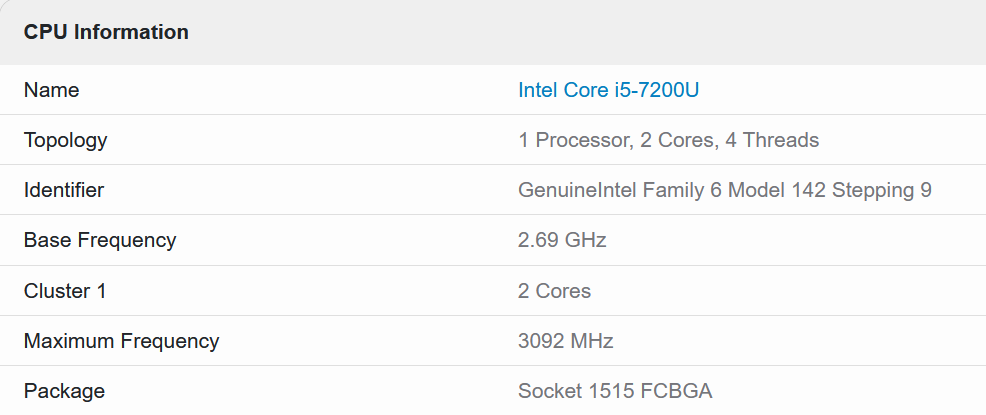

# Homework 1

## Parallelization

The program uses threads for parallelism, and two configs were tested:
* 1 thread
* 4 threads

## Number of generated messages

Two tests ran:
* 10000 publications and subscriptions
* 200000 publications and subscriptions

## Execution times 

### AMD Ryzen 7 260
| Publications | Subscriptions | Threads | Planning Time | Publication Generation Time | Subscription Generation Time | File Write Time | Total Time |
|-------------:|--------------:|--------:|--------------:|----------------------------:|-----------------------------:|----------------:|-----------:|
| 10000 | 10000 | 1 | 0.030514 s | 0.064062 s | 0.037328 s | 0.023053 s | 0.154958 s |
| 10000 | 10000 | 4 | 0.022684 s | 0.017471 s | 0.011464 s | 0.019037 s | 0.070656 s |
| 200000 | 200000 | 1 | 0.406678 s | 0.134954 s | 0.140904 s | 0.086859 s | 0.769394 s |
| 200000 | 200000 | 4 | 0.119982 s | 0.052584 s | 0.027126 s | 0.095179 s | 0.294870 s |

### Intel Core i5-7200U
| Publications | Subscriptions | Threads | Planning Time | Publication Generation Time | Subscription Generation Time | File Write Time | Total Time |
|-------------:|--------------:|--------:|--------------:|----------------------------:|-----------------------------:|----------------:|-----------:|
| 10000 | 10000 | 1 | 0.222740 s | 0.838803 s | 0.197816 s | 0.082229 s | 1.341589 s |
| 10000 | 10000 | 4 | 0.170145 s | 0.749521 s | 0.715610 s | 0.189565 s | 1.824841 s |
| 200000 | 200000 | 1 | 0.476746 s | 0.572341 s | 0.185532 s | 0.205443 s | 1.440061 s |
| 200000 | 200000 | 4 | 0.437459 s | 0.366560 s | 0.130583 s | 0.125246 s | 1.059848 s |

## Processor specifications
Processor: **[AMD Ryzen 7 260](https://www.cpubenchmark.net/cpu.php?cpu=AMD+Ryzen+7+260&id=6658)**

Processor: **[Intel Core i5-7200U](https://browser.geekbench.com/v6/cpu/703653)**

