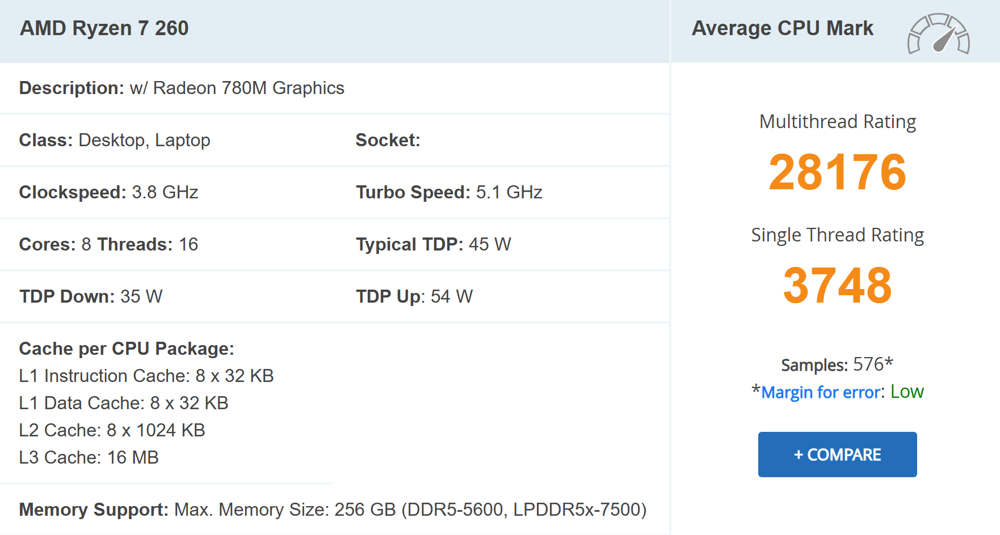

# Homework 1

## Parallelization

The program uses threads for parallelism, and two configs were tested:
* 1 thread
* 4 threads

## Number of generated messages

Two tests ran:
* 10000 publications and subscriptions
* 200000 publications and subscriptions

## Execution times 

| Publications | Subscriptions | Threads | Planning Time | Publication Generation Time | Subscription Generation Time | Results File Gen Time | Total Time |
|-------------:|--------------:|--------:|--------------:|----------------------------:|-----------------------------:|----------------------:|-----------:|
| 10000 | 10000 | 1 |    0.016911 s | 0.074665 s | 0.069910 s |            0.026449 s | 0.187934 s |
| 10000 | 10000 | 4 |    0.009115 s | 0.020321 s | 0.009603 s |            0.017302 s | 0.056342 s |
| 200000 | 200000 | 1 |    0.146416 s | 0.280663 s | 0.253601 s |            0.098633 s | 0.779313 s |
| 200000 | 200000 | 4 |    0.066878 s | 0.072866 s | 0.072689 s |            0.051748 s | 0.264180 s |

## Processor specifications
Processor: **[AMD Ryzen 7](https://www.cpubenchmark.net/cpu.php?cpu=AMD+Ryzen+7+260&id=6658)**

**NOTE**: here you can also add your own cpu and specs after testing, same for the exec runtimes

