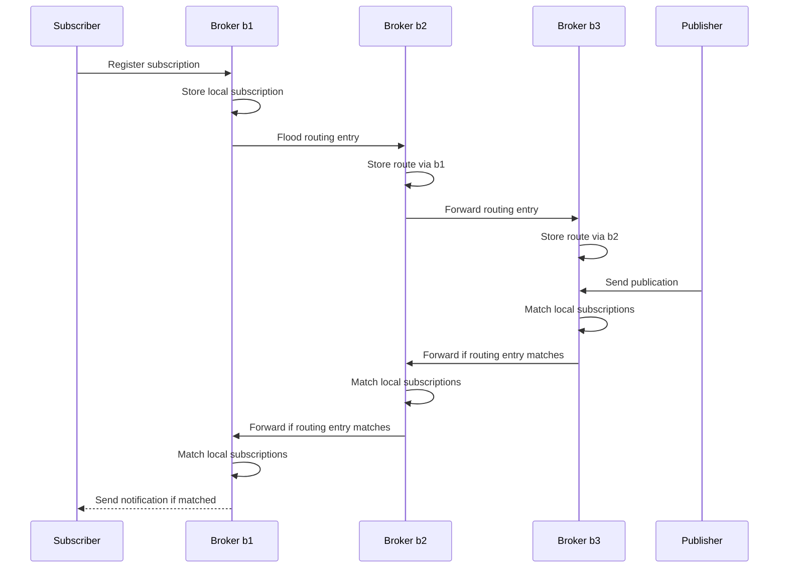
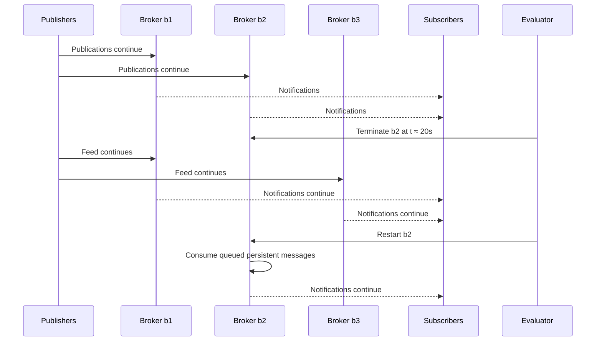

# Event-Based Publish/Subscribe System
## Evaluation Report

## 1. System summary

The project implements a content-based publish/subscribe system using publishers, subscribers and a broker overlay. The tested configuration is: **3 brokers** in the overlay `b1 -- b2 -- b3`, **3 subscribers**, **2 publishers**, **10000 subscriptions**, **RabbitMQ** for transport and **Protocol Buffers** for binary serialization.

Publishers generate publications continuously. Subscribers register generated subscriptions. Brokers store local subscriptions, exchange routing entries, match publications and forward them through the overlay.

---

## 2. Broker overlay and routing

The broker overlay is not used as a single centralized matcher. Subscriptions are distributed across brokers. Each broker stores local subscriptions received from subscribers and routing entries received from neighboring brokers.

When a publication arrives at a broker, the broker matches it against local subscriptions, sends notifications for local matches, checks routing entries and forwards the publication only to next-hop brokers that may contain matching subscriptions.

```mermaid
sequenceDiagram
    participant Sub as Subscriber
    participant B1 as Broker b1
    participant B2 as Broker b2
    participant B3 as Broker b3
    participant Pub as Publisher

    Sub->>B1: Register subscription
    B1->>B1: Store local subscription
    B1->>B2: Flood routing entry
    B2->>B2: Store route via b1
    B2->>B3: Forward routing entry
    B3->>B3: Store route via b2

    Pub->>B3: Send publication
    B3->>B3: Match local subscriptions
    B3->>B2: Forward if routing entry matches
    B2->>B2: Match local subscriptions
    B2->>B1: Forward if routing entry matches
    B1->>B1: Match local subscriptions
    B1-->>Sub: Send notification if matched
```

This is a Simple Routing approach based on subscription flooding and next-hop forwarding. A publication can pass through multiple brokers, and each broker contributes to the routing decision. The main limitation is that matching is currently linear in the number of local subscriptions and routing entries.

---

## 3. Evaluation methodology

The evaluation registers **10000 subscriptions** and then runs a continuous publication feed. Two scenarios are tested: **100% equality** on the `company` field and **25% equality** on the `company` field.

The measured values are: publications sent, delivered notifications, average latency, match rate, publication throughput and notification throughput. Match rate is computed as `delivered_notifications / (publications_sent * 10000)`, representing the percentage of all possible publication-subscription pairs that resulted in a delivered notification. Notifications per publication is also reported as a more intuitive view of the average number of subscribers matched by each publication.

### Measurement notes

Before starting the publishers, the evaluator waits for broker queues to drain and then keeps a short stabilization interval. This gives subscription advertisements and routing entries time to propagate through the broker overlay before measurements start.

Latency is measured as the difference between the timestamp assigned by the publisher and the time when the subscriber receives the notification. Since the evaluation is run on the same machine, this is acceptable for comparing scenarios. In a distributed deployment, clock synchronization would be required.

In fault-tolerant mode, the same logical publication may be sent to two broker entry points. Duplicate notifications are filtered at subscriber level using `(subscription_id, publication_id)`, so the reported delivered notifications count logical matches received by subscribers.

---

## 4. Normal execution results

Command used: `./run_demo.sh 180`

Duration: **180 seconds**.

| Scenario | Pubs | Notifications | Avg lat. | Notif/pub | Match | Pub/s | Notif/s |
|---|---:|---:|---:|---:|---:|---:|---:|
| 100% equality | 2428 | 721140 | 97.08 ms | 297.01 notif/pub | 2.970099% | 13.49 | 4006.33 |
| 25% equality | 2399 | 2830173 | 39027.03 ms | 1179.73 notif/pub | 11.797303% | 13.33 | 15723.18 |

The publication throughput is almost the same in both scenarios, around 13 publications per second. The difference appears in the number of matching subscriptions.

With 100% equality, a condition such as `company = X` is selective because it only matches publications with the same value. With 25% equality, more subscriptions contain less selective conditions such as `company != X`, which match most company values. Therefore, the 25% equality scenario delivers about 3.9 times more notifications and causes significantly higher queueing latency.

---

## 5. Fault-tolerant execution

Command used: `./run_demo.sh 90 --simulate-failure --failure-after 20 --failed-broker b2`

In this run, broker `b2` is terminated after approximately 20 seconds and then restarted. The reported metrics are aggregate values over the full 90-second run.

Fault-tolerance mechanisms used:

| Mechanism | Role |
|---|---|
| Subscription RF=2 | Each logical subscription is stored on two brokers |
| Publication replication | Each logical publication is sent to two broker entry points in fault mode |
| Durable queues | Queued messages can survive broker process restart |
| Persistent messages | Published messages are marked persistent |
| Manual ACKs | Messages are acknowledged after processing |
| Broker restart | The failed broker process is started again |
| Duplicate filtering | Duplicate notifications are ignored using publication/subscription IDs |

```mermaid
sequenceDiagram
    participant P as Publishers
    participant B1 as Broker b1
    participant B2 as Broker b2
    participant B3 as Broker b3
    participant S as Subscribers
    participant E as Evaluator

    P->>B1: Publications continue
    P->>B2: Publications continue
    B1-->>S: Notifications
    B2-->>S: Notifications

    E->>B2: Terminate b2 at t ≈ 20s
    P->>B1: Feed continues
    P->>B3: Feed continues
    B1-->>S: Notifications continue
    B3-->>S: Notifications continue

    E->>B2: Restart b2
    B2->>B2: Consume queued persistent messages
    B2-->>S: Notifications continue
```

### Fault run results

Duration: **90 seconds**.

| Scenario | Pubs | Notifications | Avg lat. | Notif/pub | Match | Pub/s | Notif/s |
|---|---:|---:|---:|---:|---:|---:|---:|
| 100% equality | 1221 | 296457 | 40.95 ms | 242.80 notif/pub | 2.427985% | 13.57 | 3293.97 |
| 25% equality | 1205 | 1048192 | 28311.43 ms | 870.70 notif/pub | 8.698689% | 13.39 | 11646.58 |

The system continues to deliver notifications in the fault-tolerant run. The same pattern appears: the 25% equality workload has a higher match rate and therefore much higher latency.

This test covers a single broker process failure while RabbitMQ, the coordinator and subscribers remain available. It does not claim exactly-once delivery under arbitrary failures.

---

## 6. Encrypted execution results

The system supports content-based filtering on encrypted messages via a Trusted Authority (TA) that applies deterministic HMAC-SHA256 hashing to string fields. Both publications and subscriptions have their string values encrypted before entering the broker network. The broker performs matching on encrypted values without seeing plaintext content. Subscribers decrypt received notifications through the TA. Equality (`=`) and inequality (`!=`) operators work correctly because the hashing is deterministic. Order-based operators (`>`, `<`, `>=`, `<=`) on string fields are not used in the generated datasets.

### 6.1 Normal run (Encrypted)

Command used: `./run_demo.sh 180`

Duration: **180 seconds**.

| Scenario | Pubs | Notifications | Avg lat. | Notif/pub | Match | Pub/s | Notif/s |
|---|---:|---:|---:|---:|---:|---:|---:|
| 100% equality (Encrypted) | 2427 | 722693 | 103.46 ms | 297.79 notif/pub | 2.977721% | 13.48 | 4015.07 |
| 25% equality (Encrypted) | 2396 | 2815219 | 37696.76 ms | 1175.38 notif/pub | 11.749662% | 13.31 | 15640.11 |

### 6.2 Fault-tolerant run (Encrypted)

Command used: `./run_demo.sh 90 --simulate-failure --failure-after 20 --failed-broker b2`

Duration: **90 seconds**.

| Scenario | Pubs | Notifications | Avg lat. | Notif/pub | Match | Pub/s | Notif/s |
|---|---:|---:|---:|---:|---:|---:|---:|
| 100% equality (Encrypted) | 1209 | 295316 | 76.58 ms | 244.26 notif/pub | 2.442647% | 13.43 | 3281.29 |
| 25% equality (Encrypted) | 1208 | 1079286 | 21295.10 ms | 893.45 notif/pub | 8.934487% | 13.42 | 11992.07 |

The results are consistent with the unencrypted runs. Throughput remains around 13 publications per second, confirming that the TA overhead is negligible at this publication rate due to in-process caching of encrypted values.

---

## 7. Notes on results

The high latency in the 25% equality case is expected. It is caused by higher match rate, larger notification volume and linear matching. A future improvement would be indexing subscriptions by field/operator/value, especially for equality filters such as `company = X`.