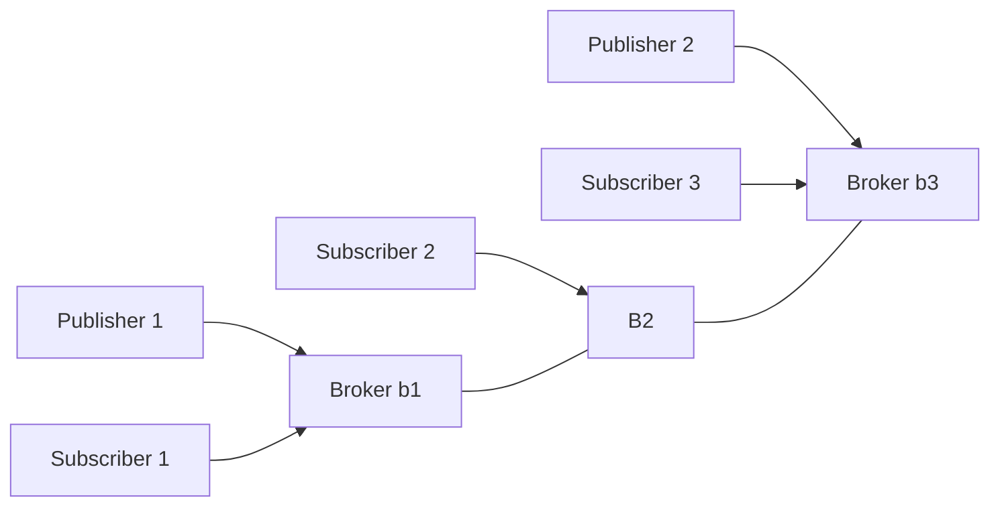
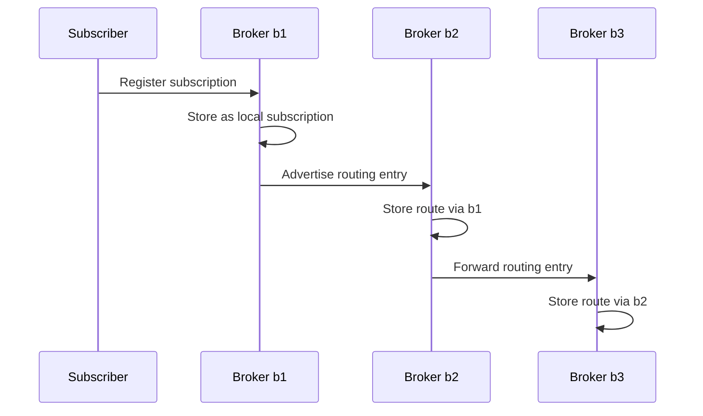
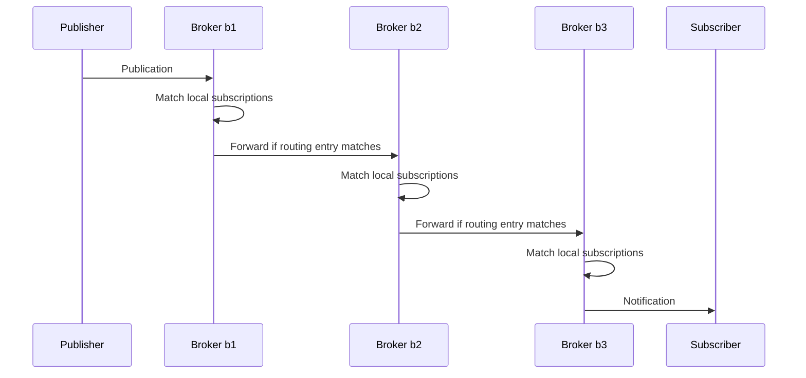
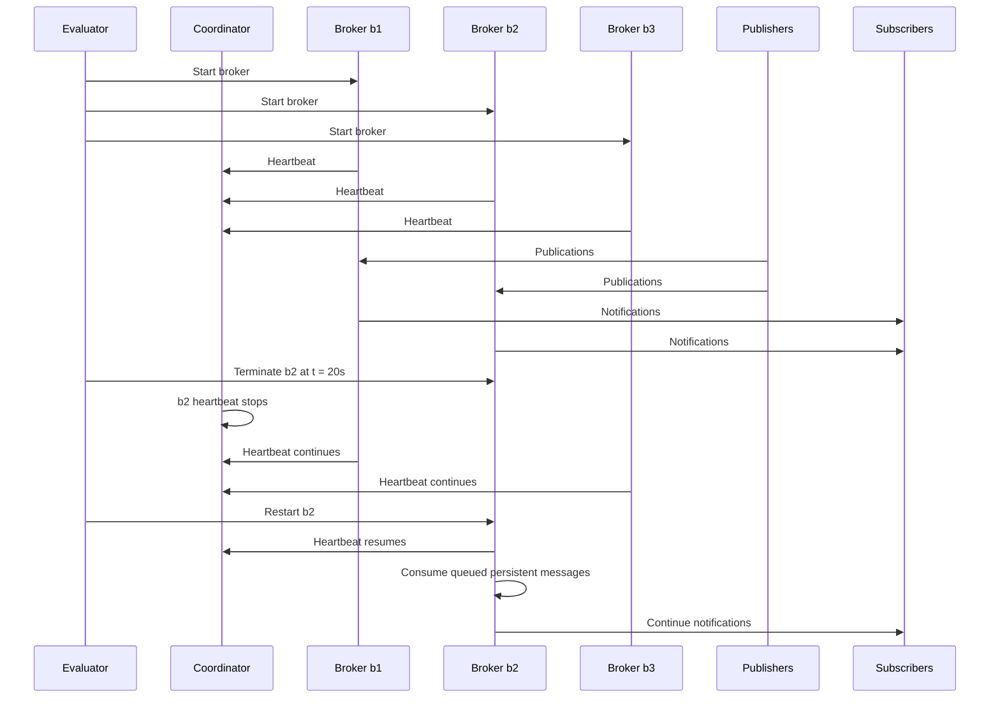

# Event-Based Publish/Subscribe System  
## Evaluation Report

## 1. Overview

This project implements an event-based publish/subscribe system with content-based filtering. The system contains publishers, subscribers and an overlay network of brokers. Publishers generate publications, subscribers register subscriptions, and brokers route publications through the overlay until the matching subscribers are notified.

The implementation includes:

- 3 brokers organized as a Simple Routing overlay: `b1 -- b2 -- b3`
- 3 subscriber nodes
- 2 publisher nodes
- 10000 generated subscriptions
- randomly generated publications
- content-based matching
- hop-by-hop broker routing
- Protocol Buffers binary serialization
- evaluation for two subscription selectivity scenarios
- fault-tolerant execution with broker failure simulation

The main purpose of the evaluation is to measure how the system behaves under different subscription selectivity levels and under a broker failure scenario.

---

## 2. System architecture

The system is composed of the following components:

| Component | Role |
|---|---|
| Publisher | Generates publications and sends them to broker entry points |
| Broker | Stores local subscriptions, stores routing entries, matches publications and forwards them through the overlay |
| Subscriber | Registers subscriptions and receives matching notifications |
| Coordinator | Maintains broker membership and broker neighborhood information |
| RabbitMQ | Transport layer used for queues and message exchange |
| Protocol Buffers | Binary serialization format used for publications, subscriptions, routing entries and notifications |

The broker overlay used in the experiments is a line topology:



The exact broker selected by publishers and subscribers is not fixed permanently. Subscriptions are distributed across the active brokers, while publications enter the network through broker entry points and are routed through the overlay.

---

## 3. Subscription registration

Subscribers generate subscriptions from the dataset and register them through the broker network. In the normal scenario, each logical subscription is stored on one broker. The 10000 subscriptions are distributed approximately evenly across the 3 brokers.

Approximate normal distribution:

| Broker | Local subscriptions |
|---|---:|
| b1 | ~3333 |
| b2 | ~3333 |
| b3 | ~3334 |

After a broker receives a local subscription, it stores it and advertises it to its neighbors. Neighboring brokers store the received subscription as a routing entry, together with the next-hop broker through which that subscription can be reached.

This is a subscription flooding mechanism. It allows each broker to make local forwarding decisions without requiring a single central broker to store all subscriptions and perform all matching.



---

## 4. Publication routing

When a publication reaches a broker, the broker performs two operations:

1. It matches the publication against its local subscriptions.
2. It checks its routing table and forwards the publication to neighboring brokers that may lead to matching subscriptions.

A publication is not matched by a single central broker only. Instead, it can pass through several brokers, and each broker performs part of the routing decision.



The current implementation performs linear matching over local subscriptions and routing entries. This is simple and correct, but it becomes expensive when many subscriptions match the same publication.

---

## 5. Binary serialization

The system uses Protocol Buffers for message serialization. Publications, subscriptions, routing entries and notifications are encoded as typed binary messages instead of being sent as plain text.

This has two advantages:

- message formats are explicitly defined;
- broker/publisher/subscriber communication avoids ad-hoc string parsing.

However, the evaluation shows that the main bottleneck is not serialization. The dominant cost is content-based matching and the volume of delivered notifications.

---

## 6. Evaluation methodology

The evaluation uses two datasets:

1. **100% equality on the `company` field**
2. **25% equality on the `company` field**

For each dataset:

- 10000 subscriptions are registered;
- 2 publishers send publications continuously;
- brokers route publications through the overlay;
- subscribers receive matching notifications;
- the system records publication count, delivered notifications, average latency and match rate.

The measured metrics are:

| Metric | Meaning |
|---|---|
| Publications Sent | Number of logical publications generated by publishers |
| Delivered Notifications | Number of notifications received by subscribers |
| Average Latency | Average time from publication timestamp to subscriber notification reception |
| Match Rate | `Delivered Notifications / (Publications Sent × Number of Subscriptions)` |
| Publication Throughput | `Publications Sent / Duration` |
| Notification Throughput | `Delivered Notifications / Duration` |

---

## 7. Normal execution results

Command used:

```bash
./run_demo.sh 180
```

Duration: **180 seconds**  
Brokers: **3**  
Subscribers: **3**  
Publishers: **2**  
Subscriptions: **10000**

### 7.1 Results table

| Scenario | Publications Sent | Delivered Notifications | Average Latency | Match Rate | Publication Throughput | Notification Throughput |
|---|---:|---:|---:|---:|---:|---:|
| 100% equality on `company` | 2428 | 721140 | 97.08 ms | 2.970099% | 13.49 pub/s | 4006.33 notif/s |
| 25% equality on `company` | 2399 | 2830173 | 39027.03 ms | 11.797303% | 13.33 pub/s | 15723.18 notif/s |

### 7.2 Interpretation

The 100% equality scenario has a relatively low match rate. Conditions such as:

```text
company = X
```

are selective, because they only match publications with exactly that company value. This produces fewer notifications and keeps the average latency low.

The 25% equality scenario produces a much higher match rate. When equality is less frequent, other operators such as inequality appear more often. A condition such as:

```text
company != X
```

is much less selective, because it matches most company values. This creates many more delivered notifications and significantly increases queueing delay.

The results show that the system is functional, but also that its performance depends strongly on subscription selectivity. The 25% equality case generates approximately 3.9 times more notifications than the 100% equality case and has much higher latency because the brokers and subscribers must process a much larger notification volume.

---

## 8. Fault-tolerant execution

The fault-tolerant run simulates the failure of one broker process.

Command used:

```bash
./run_demo.sh 90 --simulate-failure --failure-after 20 --failed-broker b2
```

In this run:

- broker `b2` is terminated after approximately 20 seconds;
- the evaluator waits for the failed process to stop;
- broker `b2` is restarted shortly after;
- the feed continues during the experiment;
- final metrics are collected over the full 90-second interval.

The system uses several mechanisms to reduce notification loss during this test:

| Mechanism | Purpose |
|---|---|
| Subscription replication factor 2 | Each logical subscription is stored on two brokers in fault mode |
| Publication replication in fault mode | Each logical publication is sent to two broker entry points |
| Durable RabbitMQ queues | Queued messages can survive broker process restart |
| Persistent messages | AMQP messages are published with persistence enabled |
| Manual acknowledgements | Messages are acknowledged after processing |
| Heartbeat-based broker monitoring | Coordinator detects broker availability |
| Broker restart | Failed broker process is started again |
| Duplicate filtering | Repeated notifications are ignored using publication/subscription identifiers |

The purpose of the fault-tolerant mode is to handle the tested case of a single broker process failure while RabbitMQ, the coordinator and subscribers remain available.



---

## 9. Fault-tolerant execution results

Duration: **90 seconds**  
Failed broker: **b2**  
Failure time: **20 seconds**  
Recovery: **broker process restarted shortly after termination**

### 9.1 Results table

| Scenario | Publications Sent | Delivered Notifications | Average Latency | Match Rate | Publication Throughput | Notification Throughput |
|---|---:|---:|---:|---:|---:|---:|
| 100% equality on `company` | 1221 | 296457 | 40.95 ms | 2.427985% | 13.57 pub/s | 3293.97 notif/s |
| 25% equality on `company` | 1205 | 1048192 | 28311.43 ms | 8.698689% | 13.39 pub/s | 11646.58 notif/s |

### 9.2 Interpretation

The system continued to deliver notifications during the fault-tolerant experiment. The results follow the same pattern as in the normal execution:

- the 100% equality case has lower match rate and low latency;
- the 25% equality case has higher match rate and much higher latency;
- notification throughput is much higher in the 25% equality case.

The increased latency in the 25% equality case is expected. A less selective workload creates more matches, which creates more notifications, which increases broker and subscriber queueing.

The fault test does not measure separate before-failure and after-failure metrics. The reported values are aggregate values over the full 90-second interval.

---

## 10. Comparison between normal and fault-tolerant runs

| Run | Scenario | Duration | Publications Sent | Delivered Notifications | Average Latency | Match Rate |
|---|---|---:|---:|---:|---:|---:|
| Normal | 100% equality | 180s | 2428 | 721140 | 97.08 ms | 2.970099% |
| Normal | 25% equality | 180s | 2399 | 2830173 | 39027.03 ms | 11.797303% |
| Fault-tolerant | 100% equality | 90s | 1221 | 296457 | 40.95 ms | 2.427985% |
| Fault-tolerant | 25% equality | 90s | 1205 | 1048192 | 28311.43 ms | 8.698689% |

The publication throughput is similar in both runs, around 13 publications per second. The major difference between scenarios is not publication rate, but the number of matching subscriptions per publication.

This confirms that the main stress factor is the content-based matching workload and the resulting notification volume.

---

## 11. Discussion

The evaluation confirms that the system satisfies the required functionality:

- publishers generate a continuous publication feed;
- subscribers register generated subscriptions;
- brokers store subscriptions and routing entries;
- publications are routed through a multi-broker overlay;
- matching is content-based;
- notifications are delivered to matching subscribers;
- the system reports delivered notifications, average latency and match rate;
- the system includes binary serialization using Protocol Buffers;
- the system simulates and handles a broker process failure.

The results also show the main limitation of the current implementation. Matching is performed linearly over the broker's local subscriptions and routing entries. This is simple and works correctly, but it becomes expensive when many subscriptions match many publications.

In the 25% equality scenario, the match rate is higher because non-equality predicates are less selective. This increases notification volume and causes large queueing delays. Therefore, the high latency in this scenario is not caused by a correctness bug, but by the workload being much heavier.

---

## 12. Limitations

The current implementation has the following limitations:

1. **Linear matching cost**  
   Each broker checks subscriptions/routing entries sequentially. This is acceptable for a simple implementation, but it does not scale optimally.

2. **High latency under high match rate**  
   When many subscriptions match each publication, the number of notifications grows quickly and queues build up.

3. **Aggregate fault metrics only**  
   The fault evaluation reports metrics over the whole interval, not separately before and after the broker failure.

4. **Limited failure model**  
   The failure test covers a single broker process failure. It does not claim full exactly-once delivery under arbitrary failures such as RabbitMQ failure, coordinator failure or multiple simultaneous broker failures.

---

## 13. Future improvements

Possible improvements include:

- indexing subscriptions by field, operator and value;
- optimizing equality predicates such as `company = X`;
- maintaining separate pre-failure and post-failure metrics;
- adding publisher confirms;
- adding an explicit replay log;
- improving routing-table compaction;
- adding more broker topologies for comparison.

A useful optimization would be an index for equality filters. For example, subscriptions containing:

```text
company = Google
```

could be stored in a map indexed by `company` and value `Google`, reducing the number of subscriptions checked for each publication.

---

## 14. Conclusion

The implemented system successfully demonstrates an event-based publish/subscribe architecture with content-based filtering and broker overlay routing.

The evaluation shows that the system delivers notifications correctly in both normal and fault-tolerant runs. The 100% equality workload has a lower match rate and low latency. The 25% equality workload generates significantly more matches and notifications, which increases average latency due to linear matching and queueing.

The fault-tolerant experiment shows that the system can continue operating when broker `b2` is terminated and restarted during the feed. This is supported through subscription replication, persistent messaging, durable queues, manual acknowledgements and duplicate filtering.

Overall, the system satisfies the project requirements and the evaluation identifies the main scalability limitation: content-based matching should be indexed in a future version to reduce latency under high-match workloads.
